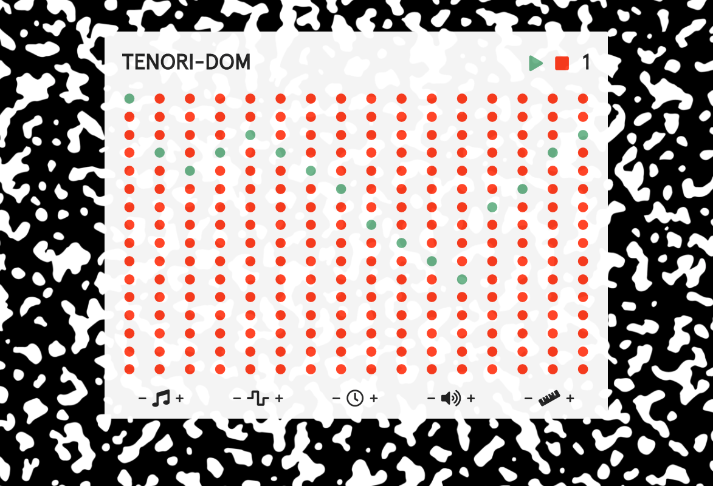

TENORI-DOM
==========

A Tenori-On inspired musical instrument created with React. The instrument is broken down 
into a 16x16 grid of notes. Each row contains a single note and each column contains every note. Yo can add notes by clicking on the circles and they will turn green once activated. You can alter the sound of of the instrument by adjusting the wave form, octave, release, tempo and volume with the corresponding control. Enjoy!
  
=====
[tenori-dom.com](https://tenori-dom.com)
=====

Currently best on Chrome/IE and Desktop. More mobile friendly designs coming soon.

This project was bootstrapped with [Create React App](https://github.com/facebook/create-react-app).

## Available Scripts

In the project directory, you can run:

### `yarn start`

Runs the app in the development mode. 
Open [http://localhost:3000](http://localhost:3000) to view it in the browser.

The page will reload if you make edits. 
You will also see any lint errors in the console.

### `yarn test`

Launches the test runner in the interactive watch mode. 
See the section about [running tests](https://facebook.github.io/create-react-app/docs/running-tests) for more information.

### `yarn build`

Builds the app for production to the `build` folder. 
It correctly bundles React in production mode and optimizes the build for the best performance.

The build is minified and the filenames include the hashes. 
Your app is ready to be deployed!

See the section about [deployment](https://facebook.github.io/create-react-app/docs/deployment) for more information.

